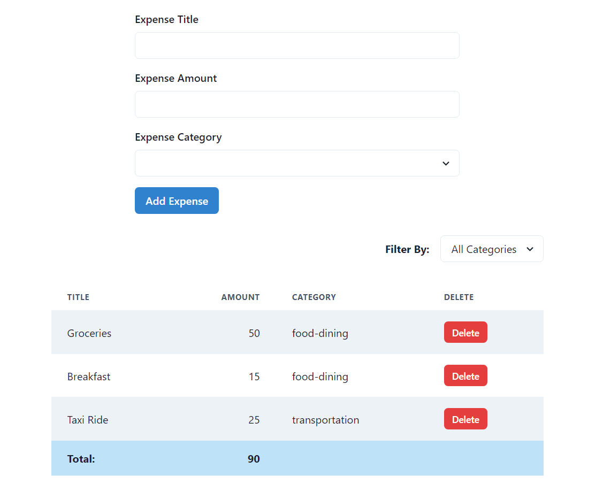
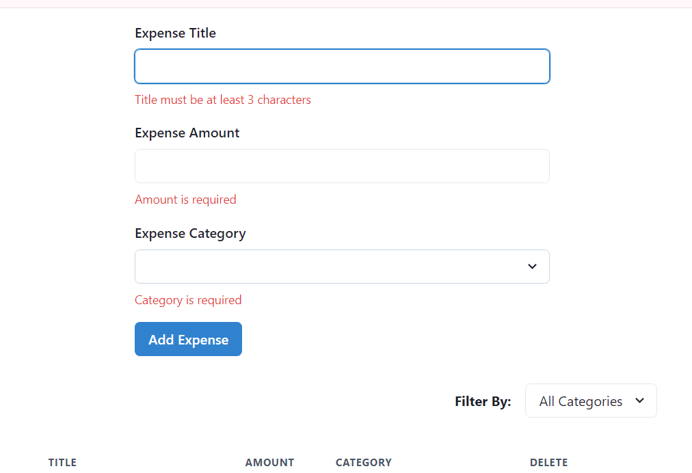

<h1>Expense Tracker Application</h1>

This is a simple expense tracker application built with React and TypeScript. The primary goal of this project was to learn how to use the **zod** library in conjunction with **react-hook-form**.

<h2>Table of Contents</h2>

- [Features](#features)
- [Technologies Used](#technologies-used)
- [Installation](#installation)
- [Usage](#usage)
- [Screenshots](#screenshots)
  - [Main Screen](#main-screen)
  - [Form Validation](#form-validation)

## Features
- Add new expenses with title, amount, and category.
- Display a list of all expenses.
- Filter expenses based on categories.
- Form validation using zod and react-hook-form.

## Technologies Used
- **React**: A JavaScript library for building user interfaces.
- **Chakra UI**: For building the UI.
- **TypeScript**: A typed superset of JavaScript that compiles to plain JavaScript.
- **react-hook-form**: A performant, flexible, and extensible forms library for React.
- **zod**: A TypeScript-first schema declaration and validation library.

## Installation
1. Clone the repository:
    ```bash
    git clone https://github.com/surajbera/rhf-expense-tracker-practise-project.git
    cd rhf-expense-tracker-practise-project
    ```
2. Install the dependencies:
    ```bash
    npm install
    ```

## Usage
1. Start the development server:
    ```bash
    npm run dev
    ```
2. Open [http://localhost:3000](http://localhost:3000) to view it in the browser.

## Screenshots
### Main Screen


### Form Validation
